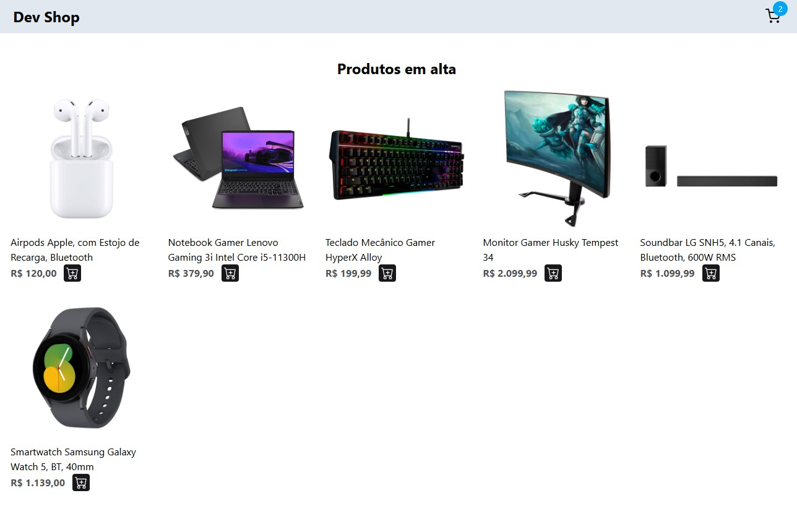
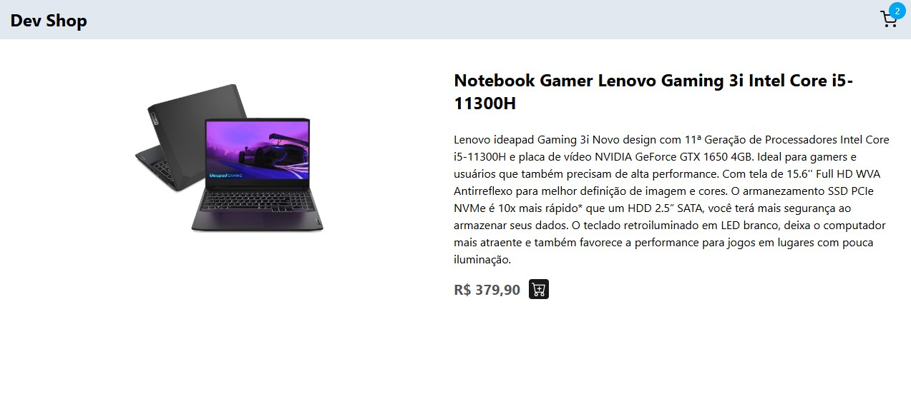
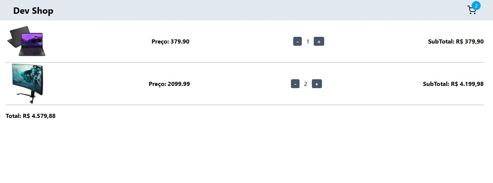

<h1 align="center">
    Cart
</h1>

<h1 align="center">
  
  
  
</h1>

<h3 align="center">
  <a href="https://cart-ju.netlify.app/" target="_blank">Access demo page</a>
<h3 >

# Index

- [About](#-about)
- [Technologies used](#-technologies-used)
- [How to install and run the project](#-how-to-install-and-run-the-project)

## 🔖&nbsp; About

**Cart** is a simple shopping cart application that allows users to browse a list of products and add items to their cart.  
It uses a fake API hosted on GitHub to fetch product data and provides an intuitive UI for selecting and managing products.

The project was built to demonstrate the use of React with TypeScript, dynamic routing, and component styling with Tailwind CSS.


---

## 🚀 Technologies used

The project was developed using the following technologies

- ReactJS
- TypeScript
- Tailwind CSS
- React Router DOM

---

## 🗂 How to install and run the project

```bash
# Clone the repository
git clone https://github.com/JuFML/cart.git

# Enter the project folder
cd cart

# Install dependencies
npm install

# Run the project
npm run dev
```
---

Developed ❤ by Juliana Fernandez